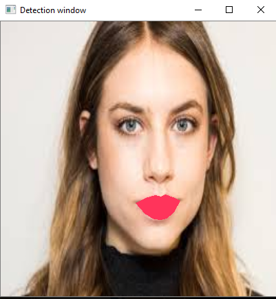
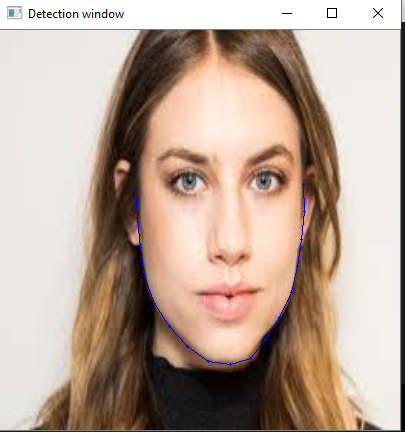
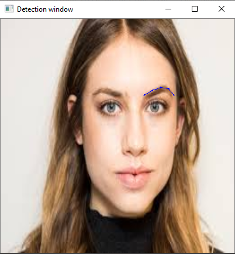

# Facial-parts-detection

## Computer Vision: Try Lipstick shades

This project uses computer vision to detect lips of the person in live video feed or image and apply different lipstick shades on the person's lips.Along with detecting lips, the program also detects eyebrows,eyes,nose and jawline of the person.

### Original image

### Lipstick shade

### Detecting jaws

### Detecting left eyebrow

### Detecting right eyebrow

### Detecting right eye

### Detecting left eye

